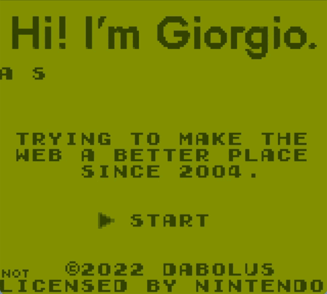

# Portfolio Cartridge

My portfolio, implemented as a retro game.

  

## What is this?

This is a reimplementation of [my portfolio](https://github.com/Dabolus/portfolio)
in the form of a retro game.

## How is it built?

The portfolio is implemented using [GBDK-2020](https://github.com/gbdk-2020/gbdk-2020),
with a mix of C and GBZ80 ASM.

The most simple assets were written by hand, but more complicated ones were
generated using either [GameBoyPngConverter](https://github.com/gingemonster/GameBoyPngConverter)
by Brian Norman, or using a web application I'm currently working on parallelly
to this project. Since most of the available tools are difficult to use on a Mac,
my plan would be to reimplement them all in my web application to ease out retro
games development for everyone, but that's another story.

## What consoles are supported?

GBDK allows exporting to a variety of SM83 and Z80 based gaming consoles, so
the idea would be to generate a working ROM for each of them. In the first phase
of the implementation I'm focusing on having it working properly on a real
Game Boy and Game Boy Color, but future targets will include:

- Game Boy
- Game Boy Color
- Analogue Pocket
- Sega Master System
- Sega Game Gear
- Mega Duck/Cougar Boy

## Why are you doing this?

Because why not?

## Can I reuse your code?

Of course! I implemented it for fun and I shared it to inspire other people.
Code is covered by the MIT license, you can find the full text [here](LICENSE).

## Who made the OST?

The music you can hear on the main menu was composed by
[TipTopTomCat](https://tiptoptomcat.itch.io/). I plan to add my own music in
the future, but creating music with a sequencer is not that easy (so support
the original author!) and I still need to learn how to use it properly. I
will replace the music with my own as soon as I'm able to sequence a song
that doesn't sound like a cat walking on a keyboard.
